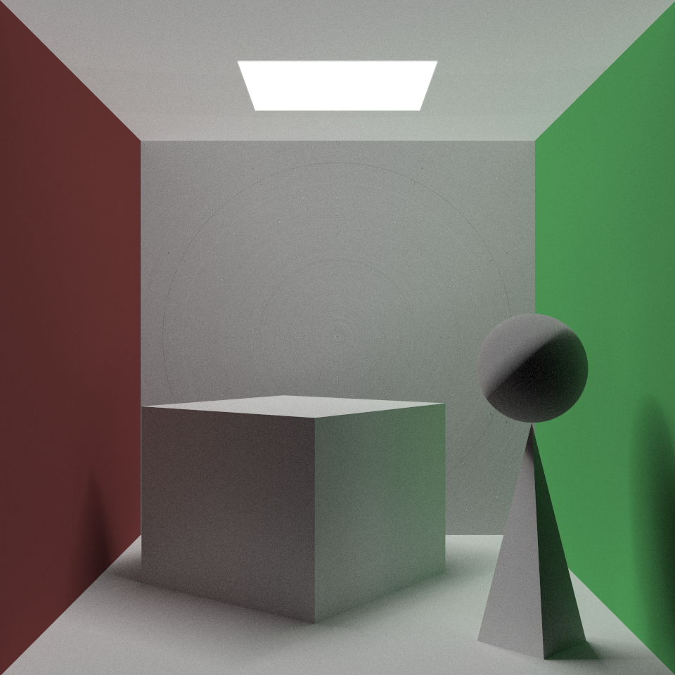
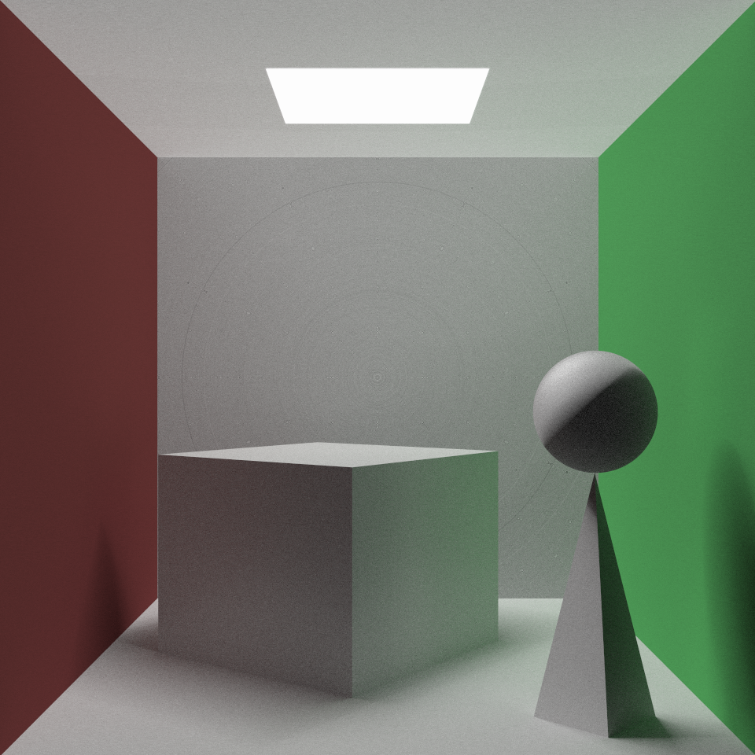
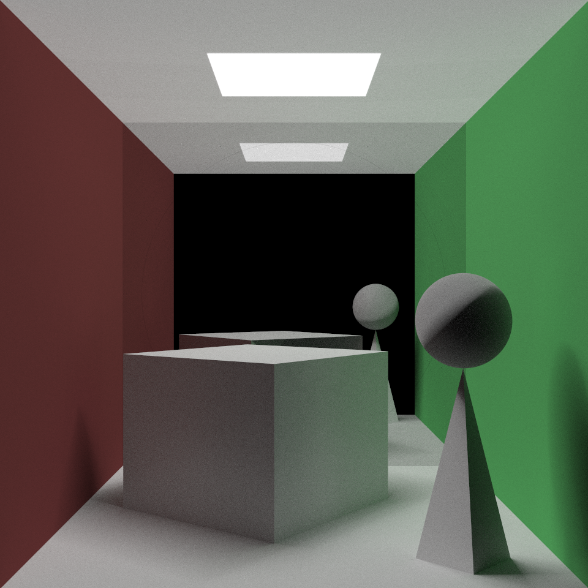
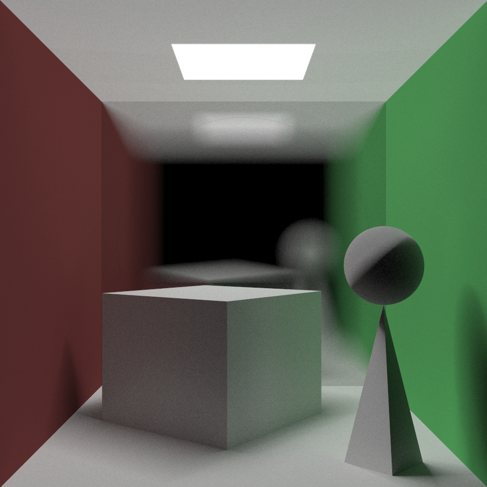
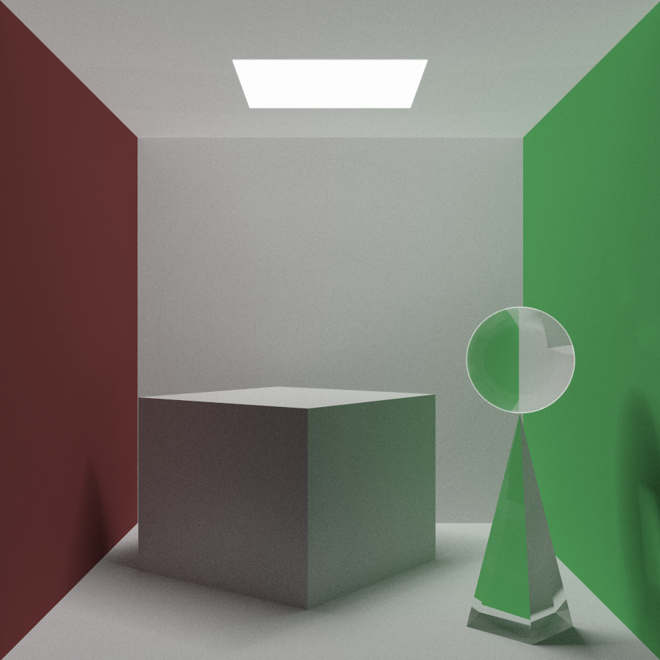
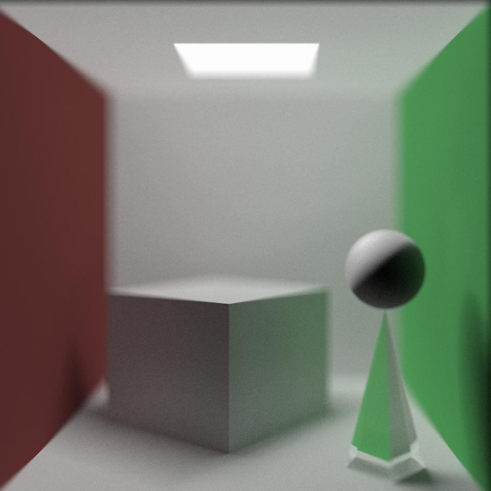
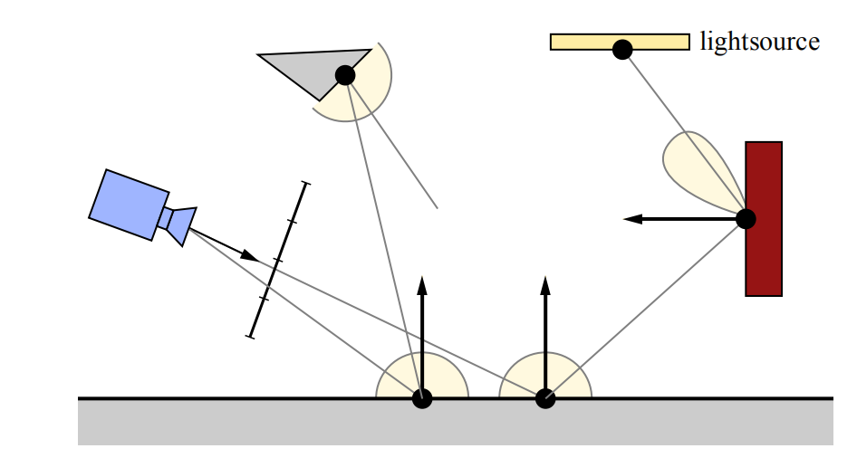
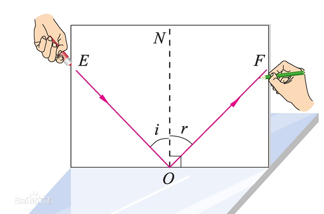
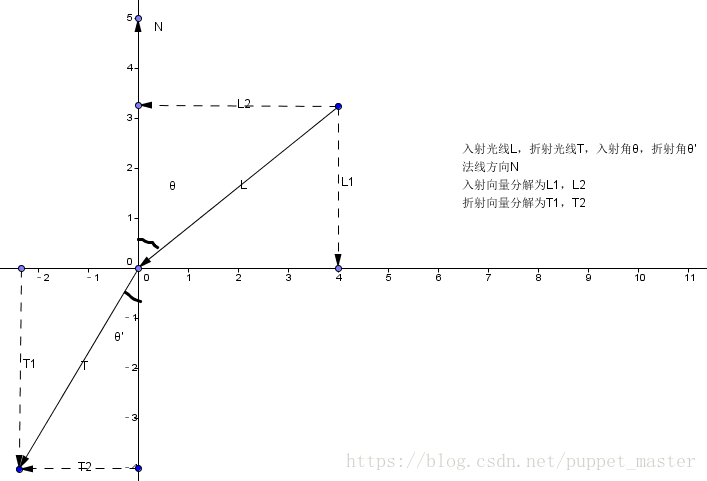

<div style="text-align:center">
    <h1>
        基于Phong模型的渲染器
    </h1>
    <p>
        小组成员  1711326 郝润来  1711328 何慧杰
    </p>
</div>

[toc]

# 完成度

1. 表面材质: Lambertain模型, Phong模型, 镜面材质(金属玻璃等), 毛玻璃材质, 有菲涅尔效应的玻璃材质

2. 实现了软阴影

3. 全局光照渲染器

4. 可以设置摄像机(位置, 景深, 视角)等属性

5. 使用`cuda C++ 10.1`加速

   

# 实验平台

+ 操作系统: `debian sid`
+ 环境: `cuda nvcc 10.1`

# 样例展示

图片在`result`文件夹中.







# 算法设计

## 1. 路径追踪

路径追踪是模拟渲染方程$L_0(x, w_0) = L_e(x, w_0) + \int_\Omega f_r(x, w_i, w_0)L_i(x, w_i)(n \cdot w)dw_i$的蒙特卡罗的模拟方法. 核心思想是从视点向一个像素发射多个采样的射线进行跟踪, 然后求解. 

一条路径追踪的射线被发射出后, 首先要对求出场景中最近的命中的物体, 然后根据物体的法向量和材质信息, 求出反射光线, 然后对反射的光线进行跟踪, 如此递归下去, 知道射线溢出场景或者达到最大深度为止.

路径追踪算法可以实现全局光照和软阴影效果



代码如下: 

```C
#       pragma region TRACE_AND_SHADE
            float u = (float(pX)+getRandom())/float(getRenderConfig().width);
            float v = (float(pY)+getRandom())/float(getRenderConfig().height);
            auto ray = getRay(u, v);
            auto color = trace(ray);
            // printf("sample -> [ %f, %f, %f ]\n", color.r, color.g, color.b);
#       pragma endregion
```

+ 根据摄像机的信息和屏幕坐标信息, 获取射线
+ 对射线进行跟踪

```C++
        __device__
        Vec3 trace(const Ray& ray) {
            int depth = getRenderConfig().depth;
            auto r = ray;
            Vec3 color = { 1, 1, 1 };
            bool isDirect = false;
            id_t directObj = 0;
            for (int i = 0; i < depth; i++) {
                if (r.direction == Vec3{ 0, 0, 0 }) {
                    break;
                }
                HitRecord hitRecord =  intersectionTest(r);
                if (hitRecord) {
                    auto scattered = shade(hitRecord->material, r, hitRecord->t, hitRecord->hitPoint, hitRecord->normal);
                    r = scattered.ray;
                    if (isDirect) {
                        auto type = getMaterial(getObject(hitRecord->object).material).type;
                        if (type == MaterialType::EMITTED) {
                            color = color * scattered.attenuation;
                            break;
                        }
                        else if (type == MaterialType::SPECULAR
                            || type == MaterialType::GLASS) {
                            continue;
                        }
                        else {
                            color = { 0.0, 0.0, 0.0 };
                            break;
                        }
                    }
                    else {
                        color = color * scattered.attenuation;
                    }
                    isDirect = scattered.isDirect;
                    directObj = scattered.directObj;
                }
                else {
                    color = { 0, 0, 0 };
                    break;
                }
            }
            // printf("[ %f, %f, %f ]\n", color.r, color.g, color.b);
            return color;
        }
```

+ 首先根据`instectionTest`, 求出与射线相交的第一个物体
  + `HitRecord`的原型是`c++14`的`optional<HitRecordBase>`, 当未命中时, 他是`nullopt`
  + `HitRecord`保存有命中位置, 命中对象, 命中射线长度, 命中位置法向量等信息.
  + 命中之后, 则根据情况进行直接光照采样和随机采样. 没有命中, 则停止采样
  + 命中光源, 
+ 调用`shade`函数根据材质信息, 进行着色, 求出光线的衰减值和反射光线
+ 对反射光线继续采样.

### 1.1 重要性采样

由于一般的路径追踪算法, 遇到了漫反射材质, 会进行随机的漫反射的采样, 这种采样遇到不封闭的场景时, 有很多采样光线不能命中光源, 会产生许多噪点. 为了降噪, 可以增加单位像素的采样次数, 但是这样需要很高的计算量. 所以, 可以进行直接到光源的采样, 这样可以减少噪点并且减少采样次数.

代码如下:

```C
            case MaterialType::LAMBERTAIN:
                if (getRandom() > 0.45f) {
                    out = normalize(normal + getRandomNormalizedVec3());
                    sample = BRDF(material, MaterialType::LAMBERTAIN, hitPoint, normal, in, out) * M_PI *  2 * cos(out, normal);
                }
                else {
                    isDirect = true;
                    auto lightSampling = sampleRandomLight(hitPoint, normal);
                    if (lightSampling) {   
                        out = normalize(lightSampling->samplePoint - hitPoint);
                        directObj = lightSampling->objId;
                        sample = BRDF(material, MaterialType::LAMBERTAIN, hitPoint, normal, in, out) * M_PI;
                    }
                }
                break;
            case MaterialType::PHONG:
                if (getRandom() > 0.6f) {
                    out = normalize(normal + getRandomNormalizedVec3());
                    sample = BRDF(material, MaterialType::LAMBERTAIN, hitPoint, normal, in, out) * M_PI * 2 * cos(out, normal);
                }
                else {
                    isDirect = true;
                    auto lightSampling = sampleRandomLight(hitPoint, normal);
                    if (lightSampling) {
                        out = normalize(lightSampling->samplePoint - hitPoint);
                        directObj = lightSampling->objId;
                        sample = BRDF(material, MaterialType::LAMBERTAIN, hitPoint, normal, in, out) * M_PI;
                        sample = sample + BRDF(material, MaterialType::PHONG, hitPoint, normal, in, out) * M_PI;
                        // PRINT(sample);
                    }
                }
                break;
```

+ 当光线遇到`phong模型材质`或者`Lambertain模型材质`的时候, 有几率进行对光源的直接采样.
+ 调用`sampleRandomLight`, 对场景中随机一个光源的随机一个位置进行采样, `sampleRandomLight`会返回一个在法线半球的光源.

```C
                    if (isDirect) {
                        auto type = getMaterial(getObject(hitRecord->object).material).type;
                        if (type == MaterialType::EMITTED) {
                            color = color * scattered.attenuation;
                            break;
                        }
                        else if (type == MaterialType::SPECULAR
                            || type == MaterialType::GLASS) {
                            continue;
                        }
                        else {
                            color = { 0.0, 0.0, 0.0 };
                            break;
                        }
                    }
```

+ 跟踪光线时如果遇到了直接采样的光线, 那么追踪时如果命中了光源, 则返回光源, 如果命中了镜面材质或者玻璃材质, 则继续追踪 , 如果逸出场景, 则中断.

### 1.2 对光源的随机性采样

在重要性采样的直接光照中, 由于光源不是点光源, 并且一个场景中有多个光源, 所以需要随机采样.

并且采样时, 只有命中物体的法线方向的半球才会被采样到.

代码如下:

```C
        __device__
        LightSampling sampleRandomLight(const Vec3& from, const Vec3& faceDirection) {
            Vec3 samplePoint;
            id_t sampleId;
            id_t lightId = std::floor(getRandom()*float(lightNum));
            for (int i=0; i<lightNum; i++) {
                float discrim;
                sampleId = gpuLightBuffer[(lightId + i)%lightNum];
                ObjectInfo& obj = gpuObjectBuffer[sampleId];
                if (obj.type == ObjectType::Triangle) {
                    float u = getRandom();
                    float v = getRandom() * (1 - u);
                    Vec3 v1 = gpuVertexBuffer[obj.i1];
                    Vec3 v2 = gpuVertexBuffer[obj.i1 + 1];
                    Vec3 v3 = gpuVertexBuffer[obj.i1 + 2];
                    Vec3 e1 = v2 - v1;
                    Vec3 e2 = v3 - v1;
                    samplePoint = v1 + e1 * u + e2 * v;
                    discrim = dot(samplePoint - from, faceDirection);
                }
                else if (obj.type == ObjectType::Sphere) {
                    samplePoint = obj.v1 + getSobolNormalized(threadIdx.x);
                    discrim = dot(samplePoint - from, faceDirection);
                }
                if (discrim > 0) return createLightSampling(sampleId, samplePoint);
            }
            return nullopt;
        }
```

+ 从一个随机的位置开始寻找光源
+ 当寻找到合适光源时, 在光源的随机的一个位置上进行采样

### 1.3 对光线的采样

#### 1.3.1 漫反射

对漫反射光线的采样是通过单位球实现的.

在法向量(是单位向量)的终点位置做一个单位球, 通过随机数获取一个随机的单位向量, 进行相加

```C++
out = normalize(normal + getRandomNormalizedVec3());
```

#### 1.3.2 镜面反射



假设$E$为入射光, $i$为入射角, $F$为反射光, $r$为反射角, 法向量为$N$, 向量都为单位向量

那么$E$在$N$上的投影的向量$L$为
$$
L = (E \cdot N) * N
$$
从$E$的起点到$F$的终点的向量$K$为
$$
K = 2 * (E + L)
$$
所以反射光的向量
$$
F = E - K = E - 2*(E \cdot N)*N
$$
代码如下:

```C
        __device__
		Vec3 reflect(const Vec3& normal, const Vec3& dir) {
            return dir - 2*dot(dir, normal)*normal;
        }
```

#### 1.3.3 折射



设折射率为 $\eta$

首先求出向量$L_1$和$L_2$为
$$
cos \theta = L \cdot N
$$

$$
L_1 = N * cos\theta
$$

$$
L_2 = L - L_1
$$

再求出$cos\theta^{'}$
$$
\eta = \frac{sin\theta}{sin\theta^{'}}
$$

$$
cos\theta^{'} = \sqrt{1 - \frac{1-cos^2\theta}{\eta^2}}
$$

由于
$$
\frac{L_2}{sin\theta} = \frac{T_2}{sin\theta^{'}}
$$
所以
$$
T_2 = (L - N \cdot cos\theta)/\eta
$$
由于
$$
T_1 = -N * cos\theta^{'}
$$
所以反射光线$T$为
$$
T = T_1 + T_2 = -N * cos\theta^{'} + T_2 = (L - N \cdot cos\theta)/\eta
$$
代码如下:

```C
        __device__ inline
        Vec3 refract(const Vec3& normal, const Vec3& dir, float cos1, float cos2, float eta) {
            return (dir - normal*cos1)/eta - normal*cos2;
        }
```


## 2. 光线求交

### 2.1 对球体求交

设球体的位置在$O$, 半径$r$, 射线为$V+tD$

球体表面的一点$X$
$$
|X - O | = r
$$

$$
(X - O) ^ 2 = r^2
$$

带入射线:
$$
(V+tD-O)^2 = r^2
$$

$$
t^2D^2+2tD(V-O)+(V-O)^2 - r^2 = 0
$$

求出$t$为
$$
t = \frac{-2D(V-0) \pm \sqrt{4D(V-O) - 4D^2((V-O)^2 - r^2)}}{2D^2} = \frac{-D(V-0) \pm \sqrt{D(V-O) - D^2((V-O)^2 - r^2)}}{D^2}
$$
代码如下:

```C
            if (obj.type == ObjectType::Sphere) {
                Vec3 oc = ray.origin - obj.v1;
                float a = dot(ray.direction, ray.direction);
                float b = dot(oc, ray.direction);
                float c = dot(oc, oc) - obj.f1*obj.f1;
                float discriminant = b*b - a*c;
                float sqrtdiscrim = std::sqrt(discriminant);
                if (discriminant > 0) {
                    float temp = (-b - sqrtdiscrim) / a;
                    if (temp < max && temp > min) {
                        auto hitPoint = ray.at(temp);
                        auto normal = (hitPoint - obj.v1) / obj.f1;
                        return createHitRecord(temp, object, hitPoint, normal, obj.material);
                    }
                    temp = (-b + sqrtdiscrim) / a;
                    if (temp < max && temp > min) {
                        auto hitPoint = ray.at(temp);
                        auto normal = (hitPoint - obj.v1) / obj.f1;
                        return createHitRecord(temp, object, hitPoint, normal, obj.material);
                    }
                }
                return nullopt;
            }
```

### 2.2 对三角形求交

设三角形的三个顶点为$V_0, V_1, V_2$, 光线为$O+tD$

Moller-Trumbore方法，求射线与三角形的交点即求解如下方程:

$$
O+tD=(1−u−v)V_0+uV_1+v_V2
$$

化简得:
$$
\begin{bmatrix} -D & V_1 - V_0 & V_2 - V_0  \end{bmatrix} \begin{bmatrix} t \\ u \\ v \end{bmatrix} = O - V_0
$$
令
$$
E_1 = V_1 - V_0
\\
E_2 = V_2 - V_0
\\
T = O - V_0
$$
根据克莱姆法则:
$$
\begin{bmatrix}     t\\u\\v \end{bmatrix} =\frac{1}{\begin{vmatrix}     -D & E_1 & E_2 \end{vmatrix} } \begin{vmatrix}     T&E_1&E_2\     -D& T& E_2\     -D & E_1& T \end{vmatrix}
$$
根据混合积公式:
$$
\begin{bmatrix}     t\\u\\v \end{bmatrix} =\frac{1}{\begin{bmatrix}     -D \times E_2 \cdot E_1 \end{bmatrix} } \begin{vmatrix}     T \times E_1 \cdot E_2\     D \times E_2 \cdot T\     T \times E_1 \cdot D \end{vmatrix}
$$
令
$$
P=D \times E_2 \\
Q=T \times E_1
$$
结果为:
$$
\begin{bmatrix}     t\\u\\v \end{bmatrix} =\frac{1}{\begin{bmatrix}     P \cdot E_1 \end{bmatrix} } \begin{vmatrix}     Q \cdot E_2\     P \cdot T\     Q \cdot D \end{vmatrix}
$$
代码如下:

```C
            else if (obj.type == ObjectType::Triangle) {
                auto castVertex = [&obj] (int i) -> const Vec3& {
                    return getVertex(obj.i1 + i);
                };
                auto e1 = castVertex(1) - castVertex(0);
                auto e2 = castVertex(2) - castVertex(0);
                auto normal = normalize(cross(e1, e2));
                auto anchor = obj.v2 - castVertex(0);
                auto P = cross(ray.direction, e2);
                float det = dot(e1, P);
                Vec3 T;
                if (det > 0)
                    T = ray.origin - castVertex(0);
                else {
                    T = castVertex(0) - ray.origin;
                    det = -det;
                }
                if (det < 0.000001f) return nullopt;
                float u, v, t;
                u = dot(T, P);
                if (u > det || u < 0.f) {
                    return nullopt;
                }
                Vec3 Q = cross(T, e1);
                v = dot(ray.direction, Q);
                if (v < 0.f || v + u > det) {
                    return nullopt;
                }
                t = dot(e2, Q);
                float fInvDet = 1.f / det;
                t *= fInvDet;
                if (t >= max || t < min) return nullopt;
                if (dot(normal, anchor) > 0) {
                    normal = -normal;
                }
                return createHitRecord(t, object, ray.at(t), normal, obj.material);
            }
```


## 3. 着色与BSDF

这部分主要是模拟渲染方程$L_0(x, w_0) = L_e(x, w_0) + \int_\Omega f_r(x, w_i, w_0)L_i(x, w_i)(n \cdot w)dw_i$

### 3.1 `Lambertain`模型材质

### 3.2 `Phong`模型材质

### 3.3 镜面反射材质

### 3.4 玻璃材质